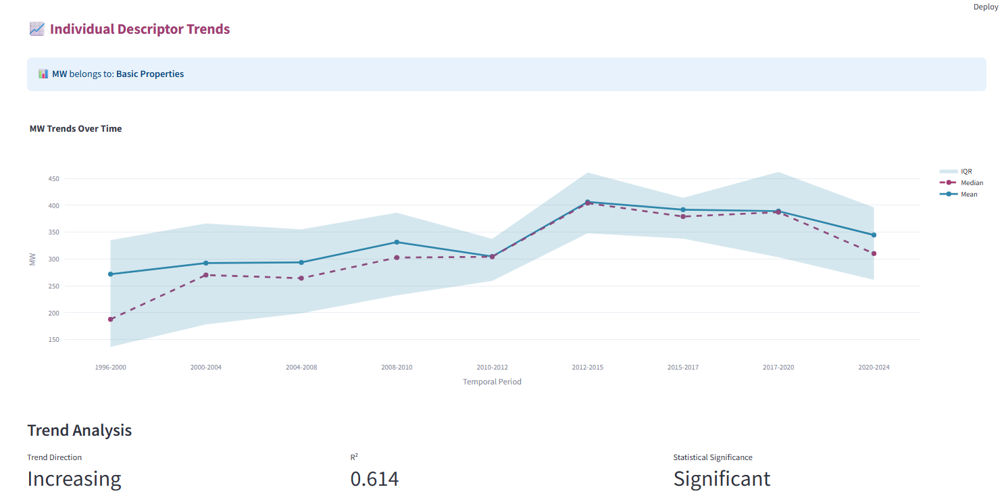

# PubChem Temporal Trends Analysis

Interactive Streamlit application analyzing temporal evolution of molecular descriptors in PubChem compounds from 1996-2024.
100 Pubchem molecules random sampled for each decades from original 116Mio compounds collection with MW<1000 from pubchem v18. To be repeated on latest version.
The idea follows several previous papers on [scaffolds](https://pmc.ncbi.nlm.nih.gov/articles/PMC5199768/), on [bibliographies](https://www.sciencedirect.com/science/article/abs/pii/S1359644614003353), 
on [medicinal chemistry-related properties](https://pubs.acs.org/doi/full/10.1021/jm300501t), on [bioactivities](https://academic.oup.com/nar/article/37/suppl_2/W623/1155303?login=false).
Longitudinally few examples: [meta-analyses published so far](https://www.nature.com/articles/s41397-025-00368-z).
Inspiration to this work I got from 

One of the results 


## Features
- **Temporal Trends**: Track molecular property changes over time
- **Statistical Analysis**: Correlation analysis with significance testing
- **PCA Analysis**: Chemical space evolution visualization
- **Period Comparison**: Statistical comparison between time periods

## Requirements
```bash
pip install streamlit pandas numpy matplotlib seaborn plotly scipy scikit-learn
```

## Usage
```bash
streamlit run pubchem_streamlit_app_v2.py   # to use just classical 2D descriptors"

streamlit run pubchem_streamlit_app_v3.py   # to use almost all 200+ RDKit 2D descriptors"
```

## Data Files Required
- `pubchem_creation_dates.csv` - CID temporal periods
- `molecular_analysis.csv` - Molecular descriptors

Explore how chemical diversity has evolved across decades!
